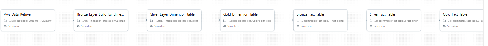

Built an End-to-End AI-Powered Data Pipeline on Databricks — from Raw Invoices to $1.79B in Sales Insights

Over the past few months, I worked on a data engineering project that combined automation, AI, and cloud infrastructure to turn raw, multi-source sales data into actionable business intelligence.

Here's what the pipeline looks like:

📥 Data Ingestion - Extracted 185K+ records from two sources: internal systems and Google Drive sales invoices. Using n8n, I automated the extraction and parsing of relevant invoice data, leveraging Groq AI for intelligent document processing, then staged everything in Google Sheets before uploading to AWS S3.

🏗️ Medallion Architecture on Databricks - Built a full Bronze - Silver - Gold Delta Lake pipeline using Databricks Jobs & Workflows:
• Retrieve data from AWS S3
• Bronze: raw ingestion from both sources
• Silver: cleaned, validated, and joined datasets
• Gold: analytics-ready views powering downstream BI

📊 BI Dashboard — Developed a comprehensive dashboard on $1.79B in sales data, surfacing:
• Revenue trends over time
• Discount impact analysis
• Peak hour & seasonal patterns
• Product-level performance metrics

The results?

1. 50% reduction in manual data entry
2. ~20% improvement in decision-making speed across sales teams

Here's a live demonstration of the end-to-end pipeline I built - from raw invoices to $1.79B in sales insights👇

Linkedin Post: https://www.linkedin.com/posts/abir-saha-418a141b9_dataengineering-databricks-deltalake-ugcPost-7451158601550704640-cw9f?utm_source=share&utm_medium=member_desktop&rcm=ACoAADLftlQB_VBmiGM0XPHgvh4ApjEH6CjeK74

This project reinforced how much value you can unlock when solid data engineering meets intelligent automation. Happy to connect with others working in the data/AI pipeline space.

hashtag#DataEngineering hashtag#Databricks hashtag#DeltaLake hashtag#n8n hashtag#AWS hashtag#BI hashtag#MedallionArchitecture hashtag#GroqAI hashtag#DataPipeline hashtag#Analytics
